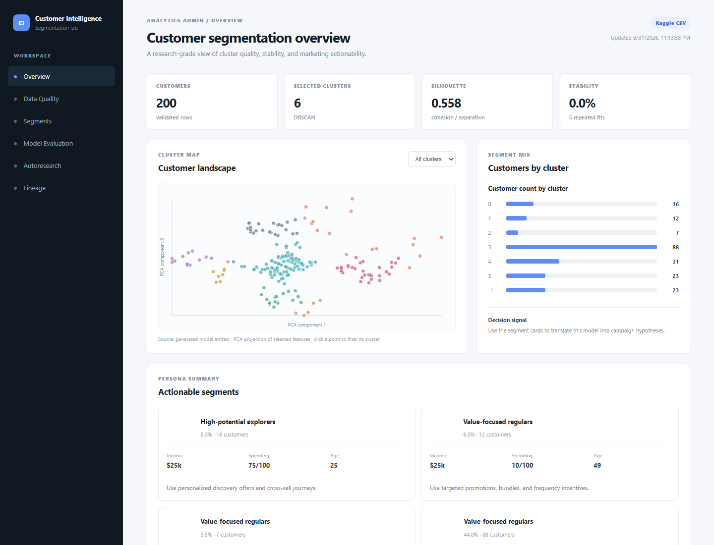
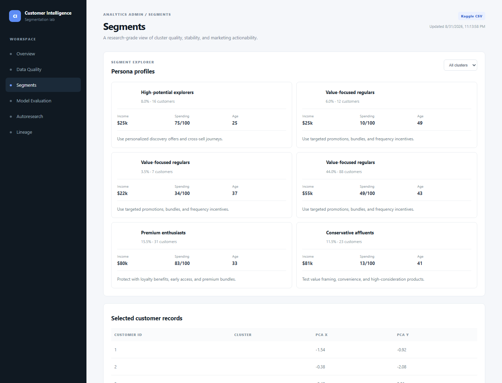
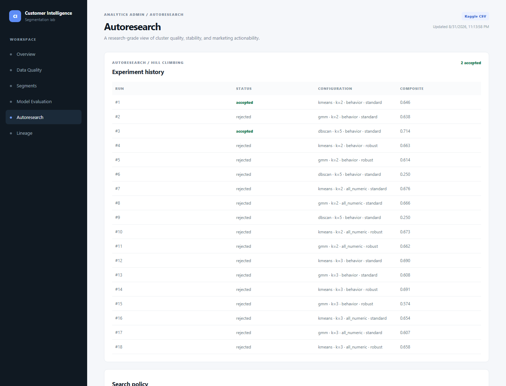

# Customer Intelligence & Segmentation Clustering

An end-to-end CRISP-DM customer segmentation project using the Kaggle Mall Customers dataset, reproducible clustering experiments, and a React/Vite data-science administration dashboard.

## Quick start

### 1. Install Python dependencies

```powershell
python -m venv .venv
.\.venv\Scripts\Activate.ps1
python -m pip install -r requirements.txt
```

### 2. Generate the model artifacts

The pipeline uses `data/raw/Mall_Customers.csv` when present. If it is absent, it creates a clearly-labelled deterministic demo copy so the app can be explored immediately.

```powershell
python -m src.pipeline
```

To use the Kaggle data, download the file from the [Mall Customer Segmentation dataset](https://www.kaggle.com/datasets/vjchoudhary7/customer-segmentation-tutorial-in-python) and save it as `data/raw/Mall_Customers.csv`.

### 3. Run the API

```powershell
uvicorn src.api:app --reload --port 8000
```

### 4. Run the dashboard

```powershell
cd frontend
npm install
npm run dev
```

The dashboard defaults to `http://localhost:5173` and the API to `http://localhost:8000`.

## Dashboard screenshots

The screenshots below show the dashboard using the deterministic demo artifact. Replace it with the Kaggle CSV and rerun the pipeline to populate the same views with the real dataset.

### Overview



### Segment explorer



### Autoresearch experiment history



## What is included

- CRISP-DM report, research notes, data dictionary, model card, dashboard specification.
- EDA and data-quality report generated from the actual input file.
- K-Means baseline plus Gaussian Mixture and DBSCAN challengers.
- Deterministic autoresearch hill-climbing loop with keep/reject experiment history.
- Internal validation: silhouette, Davies–Bouldin, Calinski–Harabasz, inertia, bootstrap stability, and cluster-balance penalty.
- Segment profiles and business-facing persona recommendations.
- FastAPI endpoints and a responsive React/Vite admin dashboard.

## Reproducibility

The default seed is `42`. All experiment configurations, package versions, input provenance, and artifact metadata are recorded under `artifacts/`. Raw Kaggle data is intentionally not committed; use `data/raw/README.md` for provenance.
