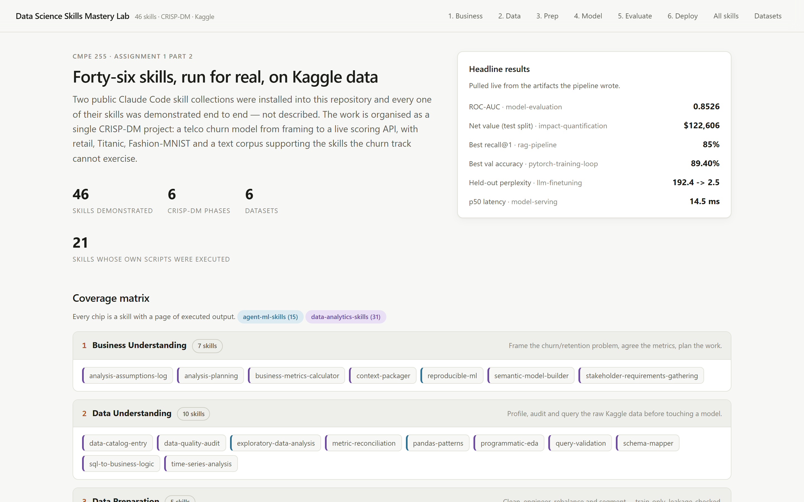

# Data Science Skills Mastery Lab

Two public Claude Code skill collections installed into this repository, and **every one of their 46
skills demonstrated end to end on popular Kaggle datasets**, organised along the six CRISP-DM phases,
with the results published as a React website.

| | |
|---|---|
| **Skills** | 15 from [`param087/agent-ml-skills`](https://github.com/param087/agent-ml-skills) + 31 from [`nimrodfisher/data-analytics-skills`](https://github.com/nimrodfisher/data-analytics-skills) = **46** |
| **Method** | CRISP-DM, all six phases, one continuous churn project plus four supporting dataset tracks |
| **Evidence** | One JSON artifact per skill in `site/public/artifacts/`, written by the code that computed it |
| **Site** | Vite + React + TypeScript + Recharts, static build, reads only those artifacts |

Nothing here is illustrative. 21 of the 46 skills ship their own Python; that code was imported and
run on the Kaggle data rather than reimplemented, and each skill page lists the files it executed.



Per-phase pages, the all-skills index, and the dataset tracks: `docs/screenshots/`.

## Quick start

```powershell
python -m pip install -r requirements.txt
./run_all.ps1                      # ~15-25 min on CPU: data, all 46 demos, coverage gate, site build
cd site; npm run preview           # then open http://localhost:4173
```

Run a single phase instead:

```powershell
python pipeline/00_download_data.py
python pipeline/crisp01_business_understanding.py    # ... crisp02 ... crisp06
python pipeline/heavy/pytorch_fashion.py             # CNN
python pipeline/heavy/llm_finetune_lora.py           # LoRA fine-tune
python pipeline/heavy/rag_pipeline.py                # hybrid retrieval
python pipeline/heavy/serve_api.py                   # starts uvicorn and smoke-tests it
python pipeline/skills_registry.py --check           # fails unless all 46 artifacts exist
```

## Datasets

All from public no-auth mirrors of the corresponding Kaggle datasets, pinned by SHA-256 in
`data/raw/manifest.json`.

| Track | Dataset | Used for |
|---|---|---|
| T1 | Telco Customer Churn (`blastchar/telco-customer-churn`) | the main supervised thread, phases 1-6 |
| T1b | Credit Card Fraud (`mlg-ulb/creditcardfraud`) | `imbalanced-data` at 0.17% prevalence |
| T2 | Online Retail (`vijayuv/onlineretail`) | quality audit, SQL, cohorts, RFM, time series, funnel |
| T3 | Titanic (`c/titanic`) | train-only imputation in `data-cleaning` |
| T4 | Fashion-MNIST (`zalando-research/fashionmnist`) | `pytorch-training-loop` |
| T5 | The 46 installed `SKILL.md` files | `rag-pipeline` corpus, `llm-finetuning` prompts |

## CRISP-DM coverage

| Phase | Skills | What it produces |
|---|---|---|
| 1 Business Understanding | 7 | scoped question, metric definitions, semantic model, assumptions log, reproducibility contract |
| 2 Data Understanding | 10 | EDA, quality audit, SQL validation, schema map, metric reconciliation, catalog entry |
| 3 Data Preparation | 5 | leakage-safe cleaning and features, imbalance handling, RFM segments, cohorts |
| 4 Modeling | 7 | pipelines, tuning, MLflow tracking, a deliberately broken model, CNN, LoRA, RAG |
| 5 Evaluation | 7 | metrics and calibration, A/B read, root cause, insights, dollar impact, QA, peer review |
| 6 Deployment | 10 | FastAPI service, dashboard spec, chart specs, exec summary, narrative, docs, retrospective |

## Layout

```
.claude/skills/          the 46 installed skills, unmodified
pipeline/
  lib/                   paths, seeds, data loaders, skill-script loader, artifact serialiser
  00_download_data.py    mirrors -> data/raw + manifest.json with digests
  crisp01..06_*.py       one module per CRISP-DM phase
  heavy/                 CNN, LoRA, RAG, and the FastAPI service + smoke test
  skills_registry.py     skill -> phase/track map, catalog writer, coverage gate
data/                    raw downloads, interim conversions, processed parquet
artifacts/               models, MLflow SQLite store, LoRA adapter, generated documents
site/                    React front end; public/artifacts/*.json is the pipeline's output
```

Each demo returns one `SkillResult` (`pipeline/lib/emit.py`) carrying narrative, KPIs, charts, tables,
a code excerpt and a takeaway. That single shape is why the site needs exactly one renderer, and why
`site/scripts/check-artifacts.mjs` can fail the build if any chart is malformed or any skill is missing.

## Known limitations

- The Telco churn observation window is assumed, not confirmed — flagged as blocking in the peer review.
- Offer economics (30% save rate, $100 offer cost) are assumptions; the value estimate ships as a range.
- The dataset tracks are unrelated; findings do not transfer between them.
- Torch is the CPU build on this machine, so the CNN and LoRA runs are deliberately small.
- ONNX export of the tuned pipeline fails on the string imputer; the joblib pipeline is what the API serves.
