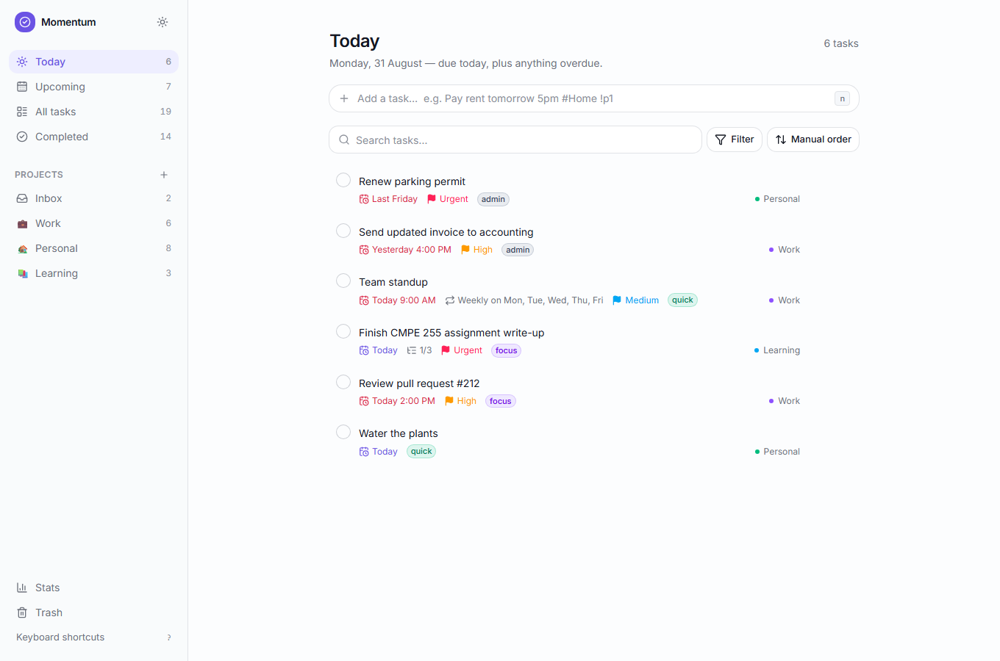
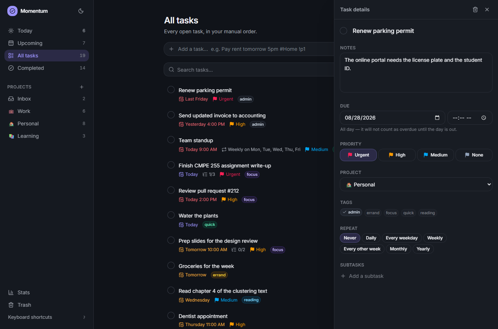
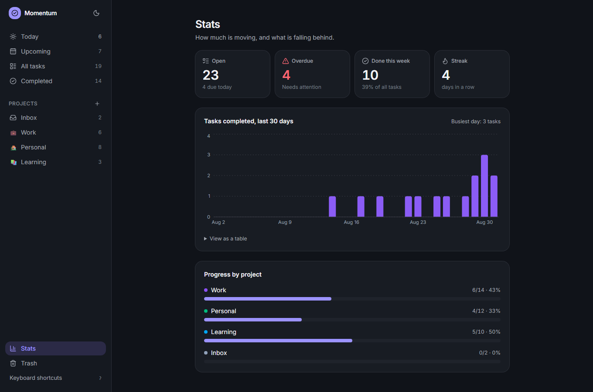

# Momentum — a dynamic todo app

A full-stack task manager built for CMPE 255 Assignment 1, Part 2. Natural-language
quick add, optimistic updates with undo, recurring tasks, drag-and-drop ordering, a
command palette, and a stats dashboard — backed by a real database, with no external
services to configure.



## Running it

```bash
npm install
npm run db:reset     # creates prisma/dev.db and seeds ~38 demo tasks
npm run dev          # http://localhost:3000
```

`db:reset` drops and recreates the local SQLite file. Prisma 7 gates that behind an
explicit consent prompt, which is deliberate — answer it, or run `npm run db:seed`
alone if the database already exists.

## What it does

**Quick add understands plain English.** Typing
`Pay rent tomorrow 5pm #Home @bills !p1` creates a task called "Pay rent", due
tomorrow at 5pm, in the Home project, tagged `bills`, at urgent priority. A preview
under the input shows exactly what will be created before you press Enter, so the
tokens are discoverable without a manual. The parser is conservative on purpose —
"Buy 5 apples" keeps its 5.

| Token | Example |
|---|---|
| Project | `#Work`, `#"Deep Work"` |
| Tag | `@errands`, `@"code review"` |
| Priority | `!p1`–`!p4`, `!urgent`, `!low` |
| Date | `today`, `tomorrow`, `friday`, `next monday`, `in 3 days`, `Mar 14`, `3/14`, `2026-03-14` |
| Time | `5pm`, `5:30pm`, `14:45`, `at 7`, `noon`, `tonight` |
| Repeat | `every day`, `every 2 weeks`, `every other week`, `every mon, wed`, `every weekday` |

**Everything is undoable.** Completing or deleting a task paints instantly and raises
a toast with Undo. Deletes are soft — a deleted task waits in Trash until you empty
it, so nothing is destroyed by a misclick.

**Recurring tasks regenerate.** Completing a repeating task marks that instance done
*and* schedules the next occurrence. Month ends clamp rather than overflow (31 Jan +
1 month is 28 Feb), and daily tasks keep their wall-clock time across a DST boundary.

**It is fully keyboard-driven.** `⌘K` opens the command palette, `n` adds, `/`
searches, `j`/`k` move, `Space` completes, `e` edits, `1`–`4` set priority, `?` lists
the lot. Drag-and-drop has a keyboard path too, via dnd-kit's keyboard sensor.



**Other things worth knowing:** Today includes anything overdue, not just today's
tasks. An all-day task due today is *not* overdue at 3pm — only timed tasks go
overdue mid-day. Completing a task removes it from the open lists and moves it to
Completed.



## Architecture

One Next.js App Router project. Server Components read, Server Actions write, and a
thin pure-functional core holds the logic worth testing.

```
app/
  layout.tsx            loads tasks/projects/tags once for the whole app
  (views)/…             today · upcoming · all · completed · trash
  project/[id]/         one project
  stats/                dashboard
  actions/              "use server" — validate with zod, persist, revalidate
components/
  app-store.tsx         client store: useOptimistic + the mutation helpers
  layout/               shell, sidebar, command palette, shortcuts
  task/                 list, row, quick add, detail panel, bulk bar
  stats/                KPI tiles and charts
  ui/                   Radix-based primitives
lib/
  db.ts                 Prisma singleton (driver adapter)
  queries.ts            server reads, flattened to DTOs
  domain/               PURE, framework-free, unit-tested
prisma/schema.prisma    Project · Tag · Task · TaskTag
```

Four decisions shaped the rest:

**Data is fetched once, in the root layout.** Every view is a slice of the same task
list, so the sidebar counts, the open view, and the command palette cannot disagree,
and one refresh after a write updates all of them.

**View and filter logic lives in `lib/domain`, not in SQL.** The date rules are the
fiddly part — "is an all-day task due today overdue?" — and running them in one
tested place beats keeping a parallel set of Prisma `where` clauses correct. A
personal todo list is small enough that this costs nothing.

**Subtasks are a self-relation on `Task`.** A subtask is a full task, so it inherits
due dates, priority, and notes for free, and there is one table instead of two.

**`position` is a float fractional index.** Dropping a row between two others writes
one row — its position is the midpoint of its neighbours — instead of renumbering the
list. `needsRebalance` reports when a gap gets too small to split again.

One thing that is not obvious from the code: the server actions call
`revalidatePath`, but these routes render dynamically, so there is no cache entry for
it to invalidate. The client store calls `router.refresh()` inside the same
transition as the optimistic update, which is what actually re-runs the server
components — and holds the optimistic state until real data replaces it.

## Testing

```bash
npm run test         # Vitest — 76 unit tests over the domain layer
npm run db:reset     # E2E expects the seeded database
npm run test:e2e     # Playwright — 19 end-to-end flows
npm run typecheck
npm run build
```

The unit tests cover the parts where being subtly wrong is invisible: recurrence
arithmetic (month-end clamping, DST, weekly `byDay` intervals), the quick-add parser,
overdue semantics, fractional indexing, sorting, search, and the stats/streak maths.
They caught two real bugs during the build — `"day" + "ly"` producing `"dayly"`, and
an all-day task being marked overdue on its own due date.

The Playwright suite drives the real app against a production build: quick-add
parsing end to end, complete/undo, delete/restore via both the toast and Trash,
recurrence regeneration, search and filtering, the keyboard-only path, a keyboard
drag that survives a reload, the detail panel, subtasks, dark mode, and a 375px
layout with no horizontal overflow.

## Accessibility

Radix primitives supply the focus traps, typeahead, and ARIA wiring. On top of that:
a skip link, visible focus rings that are never disabled, a polite live region that
announces optimistic changes (which otherwise happen silently), accessible names on
every control, a keyboard path for drag-and-drop, `prefers-reduced-motion` honoured
globally, and a table view of the chart data. Chart colours are validated for
lightness, chroma, and ≥3:1 contrast against both the light and dark surfaces rather
than picked by eye.

## Stack

Next.js 16 · React 19 · TypeScript · Tailwind v4 · Prisma 7 + SQLite (better-sqlite3
driver adapter) · Radix UI · dnd-kit · cmdk · Recharts · sonner · date-fns · zod ·
Vitest · Playwright.
