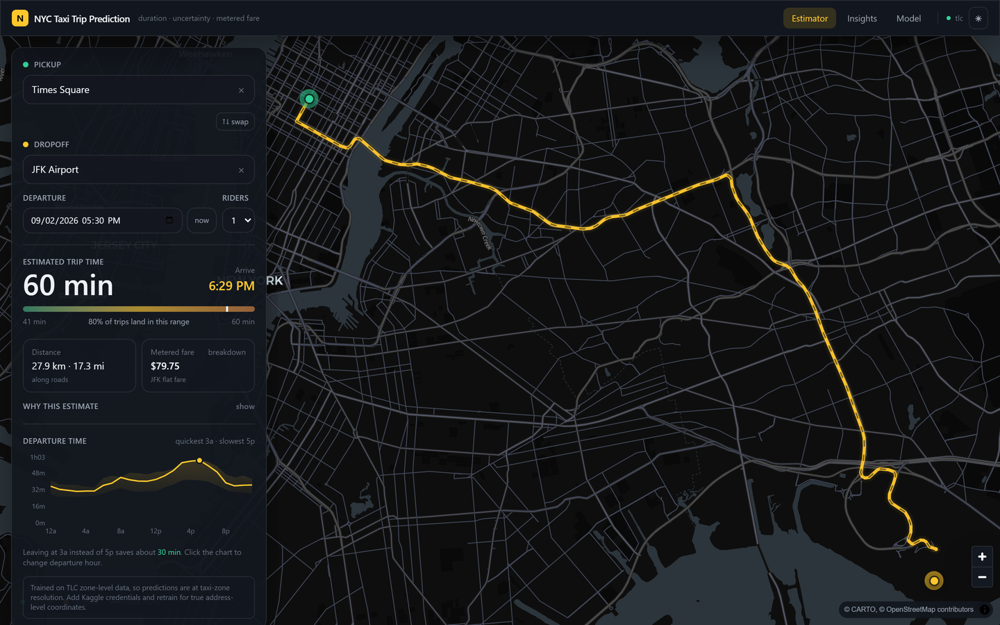
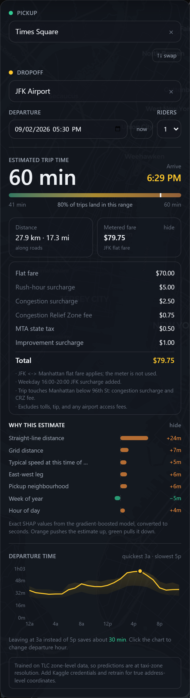
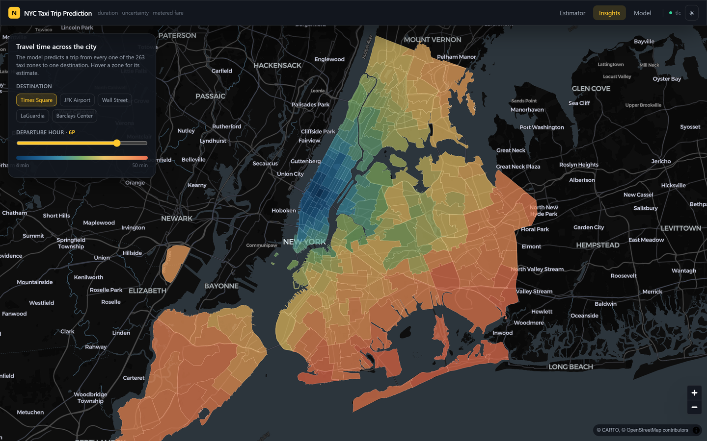
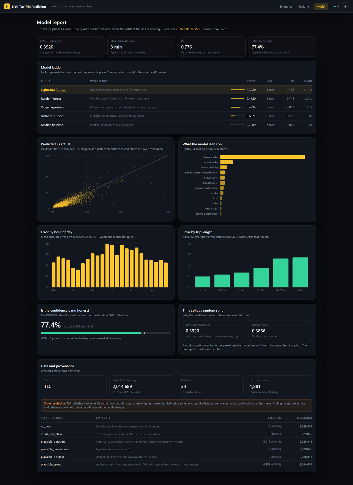
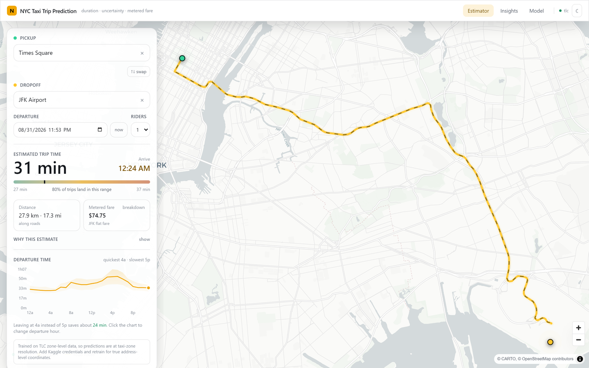

# NYC Taxi Trip Prediction

An end-to-end data science project, structured around CRISP-DM: predict how
long a New York yellow-cab trip will take, how uncertain that estimate is, and
what the meter will read — served behind an interactive map.

Drop two pins on Manhattan and you get an arrival time, a P10–P90 confidence
band, a real road route, an itemised fare, and a per-trip explanation of *why*
the model said what it said.



---

## Quick start

```powershell
./run.ps1
```

That creates the virtualenv, installs dependencies, downloads data, trains the
model ladder, renders the evaluation report, builds the frontend, and serves
everything at **http://127.0.0.1:8000**.

On Linux/macOS: `make setup && make train && make frontend && make serve`

Already trained? `./run.ps1 -Serve` skips straight to serving.
Port taken? `./run.ps1 -Port 8100`.

> **No Kaggle credentials needed.** The pipeline falls back to NYC TLC's open
> data automatically. See [Data sources](#data-sources) for what that costs.

---

## What it does

### Estimator
Full-bleed dark map. Click to set pickup and dropoff, or search an address;
drag either pin to adjust. The app draws the real driving route, then shows:

<table>
<tr>
<td width="58%" valign="top">

- **Arrival time and duration**, with the P10–P90 band drawn to scale
- **Metered fare**, itemised — initial charge, distance/time units, rush-hour
  and overnight surcharges, congestion surcharge, CRZ fee, MTA tax
- **Why this estimate** — exact SHAP contributions from the model, converted
  from log-space into the seconds each factor added or removed
- **A 24-hour departure curve** answering "leave now, or wait?" — click any
  hour to re-estimate

The trip shown is Times Square → JFK leaving 5:30pm on a Wednesday. The model
puts it at 60 minutes; the same trip at 3am is half that, which is the whole
reason time-of-day features exist. The fare correctly applies the **$70 JFK
flat fare** rather than metering it, plus the weekday evening surcharge.

</td>
<td width="42%" valign="top">



</td>
</tr>
</table>

### Insights
The model predicts a trip from **all 263 taxi zones** to a destination you
pick, and paints the result as a choropleth. Move the hour slider and the whole
city recolours. This is the deployed model's own view of New York, not a static
historical average.



### Model
The evaluation report, in the browser: the model ladder, error sliced by hour
and trip length, predicted-vs-actual, feature importance, interval calibration,
the time-vs-random split comparison, and the full cleaning audit trail. It
reads the same `metrics.json` the written report does, so the two cannot
disagree.



### Light theme
The UI and the basemap switch together — CARTO `dark-matter` ↔ `positron`.



---

## Results

Validation is a **time-based** split — the newest 20% of trips, so the model
always predicts the future relative to its training data.

| Model | RMSLE | MAE | R² |
|---|---:|---:|---:|
| Global median | 0.7289 | 429s | −0.088 |
| Distance ÷ mean speed | 0.6371 | 349s | 0.200 |
| Ridge regression | 0.4994 | 306s | −0.010 |
| Random forest | 0.4130 | 210s | 0.745 |
| **LightGBM** (production) | **0.3920** | **197s** | **0.776** |

**P10–P90 interval coverage: 77.4%** against a nominal 80% — within tolerance,
so the band can be read at face value. That check is the difference between a
confidence interval and a decorative gradient.


---

## CRISP-DM

| Phase | Document | What is in it |
|---|---|---|
| 1. Business understanding | [01](docs/01-business-understanding.md) | The question, success criteria, why RMSLE, honest scope limits |
| 2. Data understanding | [02](docs/02-data-understanding.md) | Both sources, the canonical schema, data-quality findings |
| 3. Data preparation | [03](docs/03-data-preparation.md) | Cleaning audit trail, 34 features, **the leakage guard** |
| 4. Modeling | [04](docs/04-modeling.md) | The ladder, hyperparameters, quantile band |
| 5. Evaluation | [05](docs/05-evaluation.md) | *Generated* — metrics, residuals, error slices, calibration |
| 6. Deployment | [06](docs/06-deployment.md) | Architecture, endpoints, monitoring, train/serve skew |

---

## Architecture

One FastAPI process serves the JSON API **and** the built React bundle — no
second runtime, no production CORS, one thing to deploy.

```
src/nyctaxi/
├── config.py            typed access to config.yaml
├── data/
│   ├── zones.py         TLC shapefile → WGS84 GeoJSON (EPSG:2263 → 4326)
│   ├── kaggle_source.py true coordinates (needs credentials)
│   ├── tlc_source.py    open parquet, zone-sampled coordinates
│   └── loader.py        source selection → canonical schema
├── clean.py             quality rules, each logging its row-count delta
├── features.py          34 features + out-of-fold target encoding
├── train.py             the five-model ladder + quantile band
├── evaluate.py          figures and the written evaluation report
├── fare.py              TLC rate card (deterministic, not learned)
├── registry.py          versioned artifacts + `latest` pointer
└── api/                 FastAPI app, inference service, OSRM/Nominatim proxies

frontend/                Vite · React 19 · TypeScript · Tailwind 4 · MapLibre GL
```

**Stack.** LightGBM · scikit-learn · pandas · FastAPI · React 19 · MapLibre GL
· Recharts. Maps use CARTO basemaps, OSRM routing and Nominatim geocoding —
all free, all key-less.

---

## Data sources

The pipeline reads two sources into **one canonical schema**, so nothing
downstream knows or cares which was used.

**Kaggle `nyc-taxi-trip-duration`** (preferred) — the only NYC taxi dataset
that still carries true pickup/dropoff coordinates. TLC re-encoded its entire
historical archive to zone IDs; I confirmed this by reading the parquet footer
of `yellow_tripdata_2016-01` directly, and there are no lat/lon columns.

**NYC TLC public parquet** (automatic fallback) — open, no credentials. Since
it publishes zone IDs rather than points, trip endpoints are sampled *inside*
the zone polygon (centroids would collapse two million trips onto 263 dots).
Predictions are therefore **zone-resolution, not address-resolution**. The UI
and the model report both say so when this path was used.

To upgrade — no code changes:

1. kaggle.com → Settings → API → **Create New Token**
2. Accept the `nyc-taxi-trip-duration` competition rules
3. Save `kaggle.json` to `~/.kaggle/`
4. `./run.ps1 -Retrain`

---

## Development

```bash
make test        # 75 tests
make lint        # ruff + tsc
make train SAMPLE_FRAC=0.02   # fast wiring check
make docker      # container
```

Frontend dev server with hot reload (API must be running separately):

```bash
cd frontend && npm run dev        # API_PORT=8100 npm run dev if 8000 is taken
```

The test suite covers the fare rate card exactly, the feature transforms
against known distances, polygon geometry, metric definitions, API validation,
and — most importantly — **asserts that the out-of-fold encoding actually
differs from a full-data fit**, which is the signature of the leak it prevents.
Model-dependent tests skip cleanly when no artifact is present, so a fresh
clone and CI both run a meaningful suite.

---

## Known limits

- Traffic, weather and incidents are not modelled. The model learns *typical*
  conditions for a time and place; the P10–P90 band is how that uncertainty is
  communicated rather than hidden.
- The shipped model is trained on Q1 2016 TLC data at zone resolution.
- OSRM and Nominatim are free public services. They are cached and proxied
  server-side, and the UI degrades to a straight line if either is unavailable.
- Docker files are written and reviewed but were **not executed** — Docker is
  not installed on the development machine.
