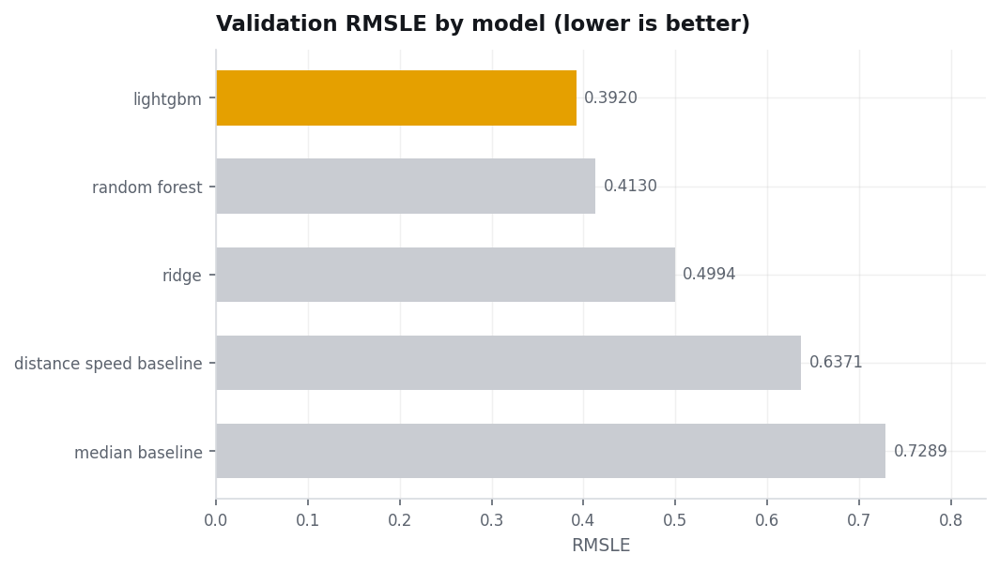
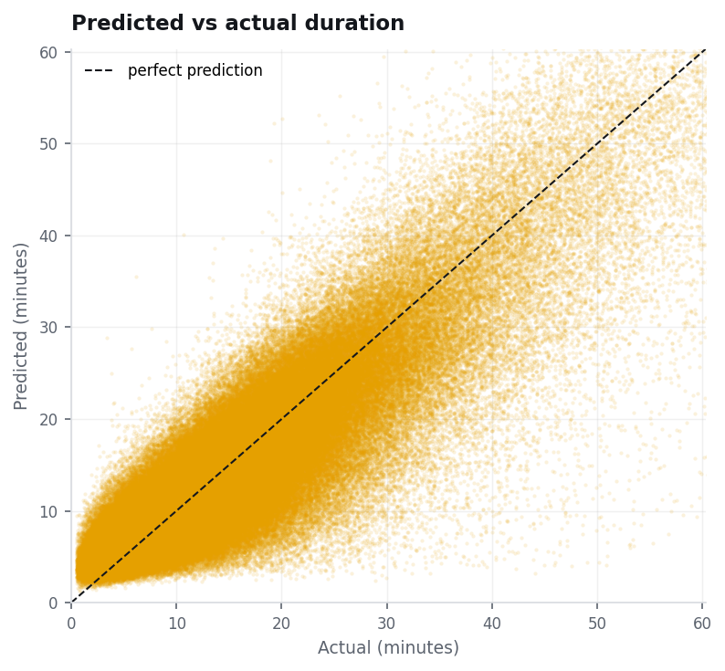
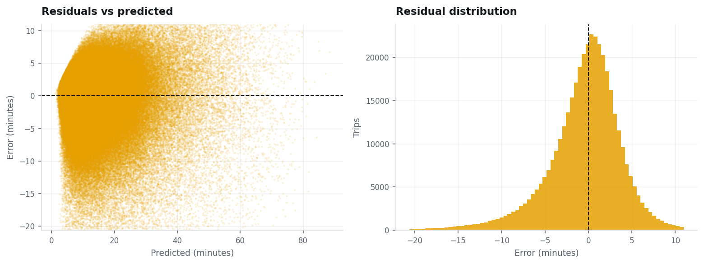
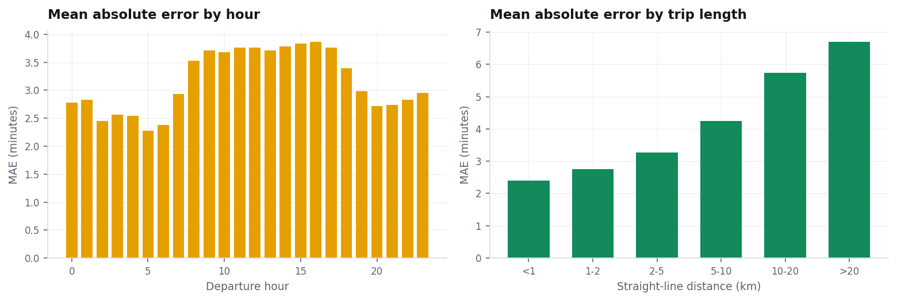
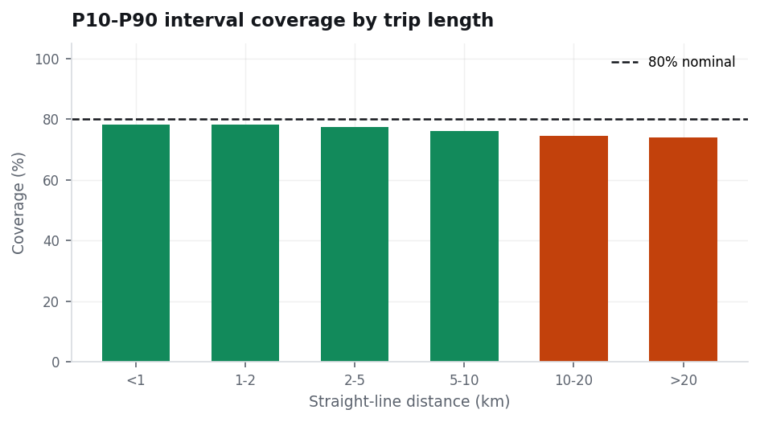
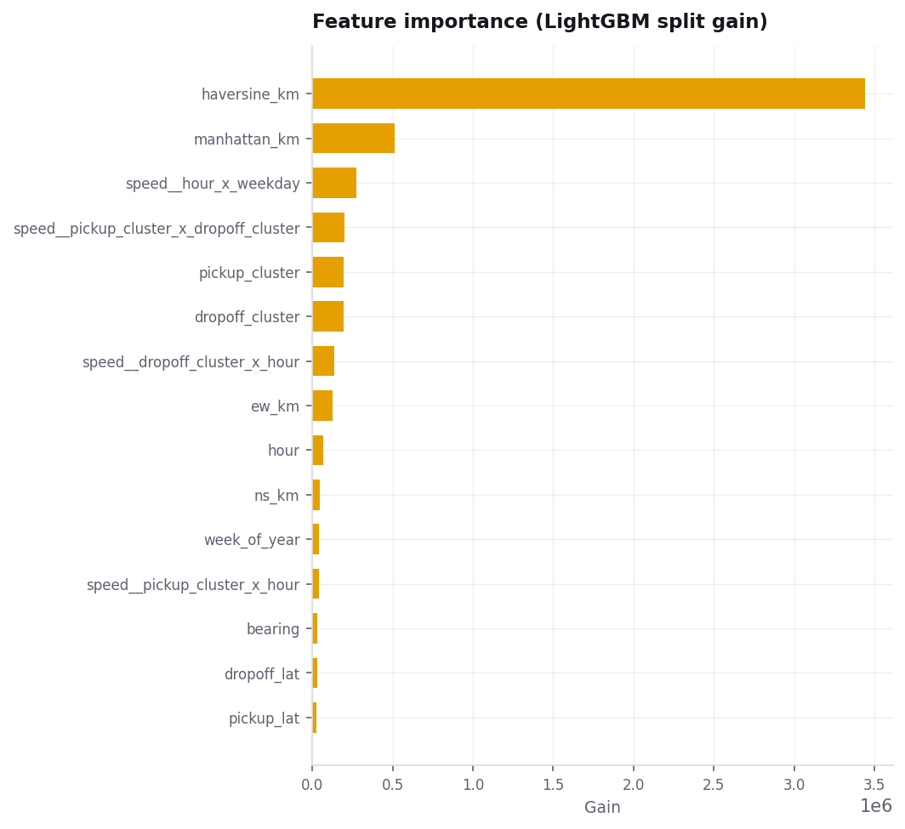

# CRISP-DM phase 5 -- Evaluation

**Model version `20260901-021505`** · trained 2026-09-01T02:15:05 · commit `242257d`
· data source **tlc** · 2,014,689 clean rows
(1,611,751 train / 402,938 validation).

## Headline results

| Metric | Value | Reading |
|---|---:|---|
| RMSLE | **0.3920** | Competition metric. Scores proportional error, so a 5-minute miss counts far more on a 6-minute hop than on a 90-minute airport run. |
| MAE | **3.3 min** | Typical miss in wall-clock terms. |
| RMSE | 4.9 min | Punishes the large misses. |
| MAPE | 32.3% | Relative error. |
| R² | 0.776 | Variance explained on raw seconds. |

## Model ladder

Each rung exists so the next one has to earn its place.

| Model | What it does | RMSLE | MAE | R² |
|---|---|---:|---:|---:|
| lightgbm | Gradient-boosted trees on the full feature set. | 0.3920 | 3.3 min | 0.776 |
| random forest | Depth-capped forest on a 150k-row subsample. | 0.4130 | 3.5 min | 0.745 |
| ridge | L2 linear regression on standardised numeric features. | 0.4994 | 5.1 min | -0.009 |
| distance speed baseline | Straight-line distance / mean training speed. | 0.6371 | 5.8 min | 0.200 |
| median baseline | Predict the global median duration. | 0.7289 | 7.1 min | -0.088 |

## Does the model predict well?

Residuals should sit around zero with no trend against the prediction. A fan
opening to the right would mean the model is systematically worse on long
trips beyond what RMSLE already accounts for.

## Where does it fail?

Error is reported by departure hour and by trip length, because an average
hides exactly the cases a rider cares about -- rush hour and airport runs.

## Is the confidence band honest?

Coverage is **77.42%** against a nominal 80%, with a median band
width of 9.1 minutes. That is within 5 points of nominal, so the band can be read at face value.

This is the test that keeps the P10-P90 interval from being decorative. A band
that covers far less than 80% is overconfident; one that covers far more is
uselessly wide.

## What the model leans on

## Time split vs random split

| Split | RMSLE |
|---|---:|
| Time-based (reported) | 0.3920 |
| Random | 0.3866 |

A random split scores better because it lets the model see traffic from the same days it predicts. The time split is the honest number.

---
*Generated by `python -m nyctaxi.evaluate`. Figures and numbers come from the
same model artifact the API serves.*
