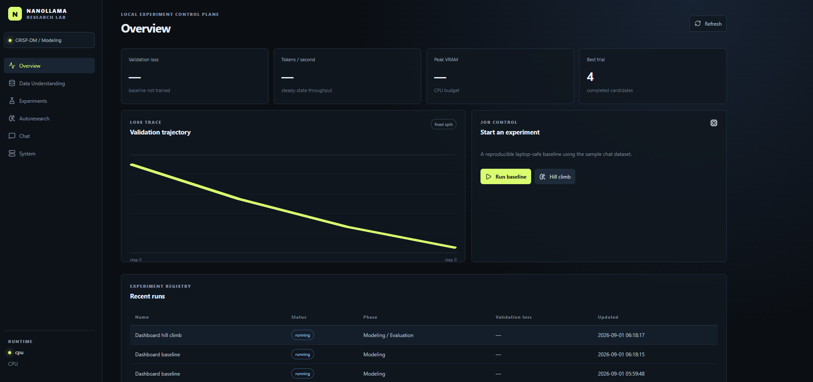
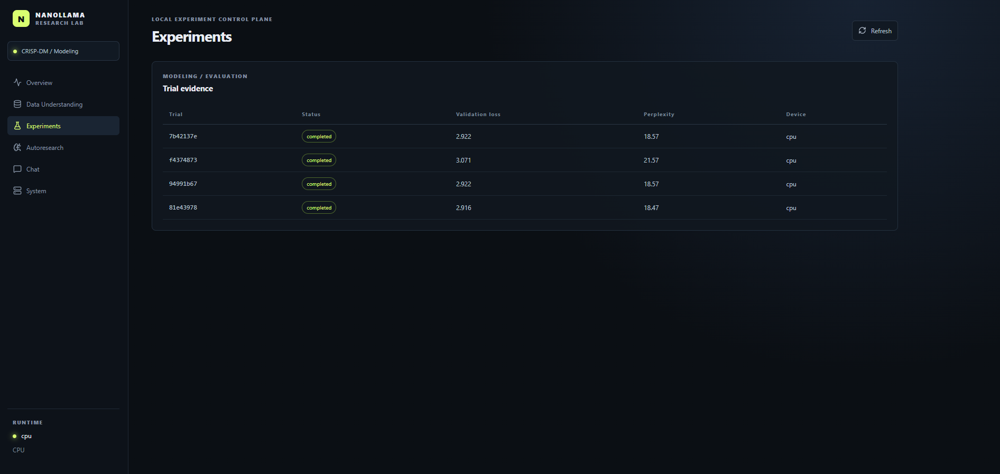
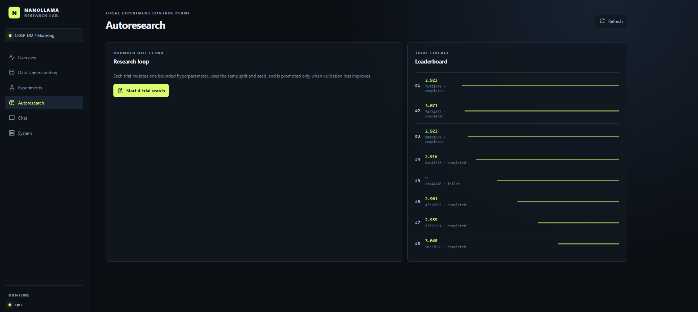
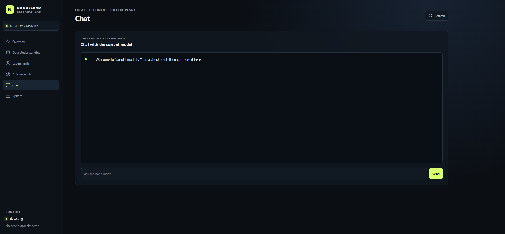
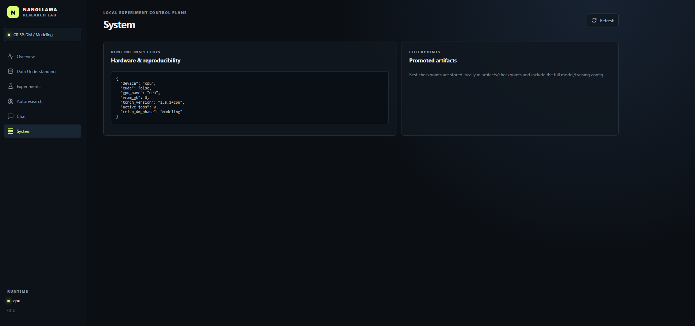

# NanoLlama Research Chatbot

A local, CRISP-DM-oriented autoregressive SFT lab: train a small decoder-only transformer from scratch, run bounded hill-climbing experiments, inspect the evidence in a React dashboard, and chat with the best checkpoint.

## Quick start

### Backend

```powershell
python -m venv .venv
.\.venv\Scripts\Activate.ps1
pip install -r backend\requirements.txt
uvicorn app.main:app --reload --app-dir backend
```

For CUDA training, install the PyTorch wheel appropriate for the laptop from the official PyTorch selector before installing the remaining requirements. The generic requirement is suitable for CPU smoke tests; CUDA wheels are driver/platform specific.

### Frontend

```powershell
cd frontend
npm install
npm run dev
```

Open `http://localhost:5173`. The backend runs at `http://localhost:8000`.

## Screenshots

### Research console overview

The Overview view surfaces the primary experiment KPIs, validation trajectory, job controls, and recent experiment registry.



### Experiments

The Experiments view provides trial-level evidence for comparing validation loss, perplexity, status, and execution device.



### Autoresearch

The Autoresearch view tracks bounded hill-climbing trials, validation-loss improvements, and trial lineage.



### Chat playground

The Chat view provides a checkpoint playground for testing the current model while keeping the active CRISP-DM phase and runtime status visible.



### System and reproducibility

The System view exposes runtime hardware, device detection, and checkpoint information for reproducible local experiments.



Run a quick training job from the dashboard, or use:

```powershell
python backend\scripts\train_demo.py
```

## Dataset format

Put JSONL chat records in `data/`. Each row is:

```json
{"messages":[{"role":"user","content":"What is CRISP-DM?"},{"role":"assistant","content":"It is a lifecycle for data-mining projects."}]}
```

The loader also accepts `prompt` and `completion` fields. Splits are deterministic, malformed records are rejected, and the dashboard reports token-length and duplicate diagnostics.

## Design notes

- CRISP-DM phase is visible in the dashboard and stored on every experiment.
- Trials use a fixed validation split and a fixed step/time budget. The objective is validation cross-entropy loss.
- The model uses RMSNorm, RoPE, SwiGLU, tied embeddings, causal SDPA, mixed precision, gradient clipping, and checkpoint resume.
- CUDA is used automatically when available; CPU remains a supported smoke-test path.
- SQLite stores experiment/trial metadata. JSONL metric streams remain easy to inspect and archive.

This is an educational laptop-scale model, not a claim of frontier model quality. The efficient primitives are selected for reproducibility and constrained hardware.
